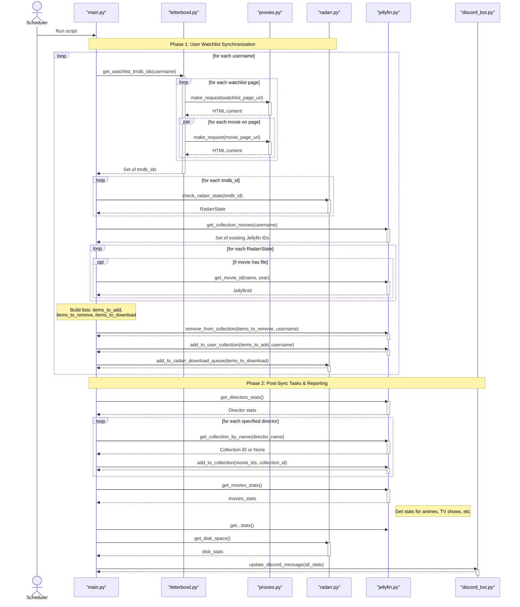

# Letterboxd-Jellyfin Integration

This is a simple script that allows you to import your Letterboxd watchlist into Jellyfin. It will create a new Jellyfin collection for each Letterboxd user and add all movies from their watchlist to it. 

## Features

- Scrapes Letterboxd watchlist 
- Link Letterboxd movies to Radarr
- Create Jellyfin collections for each Letterboxd user
- Add movies to Jellyfin collections

## How it works

- The script will scrape the Letterboxd watchlist of each user and obtain the tmdb ID of each movie
- Then for each movie it will search for a match in Radarr and obtain information about file presence and monitored status
- The script will then get all movies from the actual Jellyfin user watchlist collection 
- For each movie that has a file in Radarr, we search for a corresponding movie in Jellyfin and get its ID
- We remove all movies from the collection that are not in the Letterboxd watchlist
- We add all movies to the collection that are in the Letterboxd watchlist but not in the Jellyfin watchlist and are already downloaded in Radarr
- We add all movies to the download queue in Radarr if they are not monitored yet

Detailed information about the process can be found in here :

## Deployment

This script is not meant to be run on another system than mine. It is not very user friendly and I have no intention of making it so. If you want to use it, you will have to modify it to suit your needs. 

Currently, the script is deployed as a docker container and run as a cronjob every 10 minutes. The docker container is built automatically using my custom deployment pipeline that can be found [here](https://github.com/MathisVerstrepen/ApolloLaunchCore).
