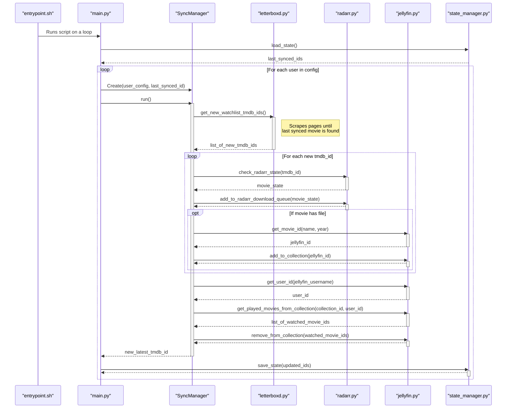

# Letterboxd-Jellyfin Integration

Automatically sync your Letterboxd watchlist with Jellyfin and Radarr. This script creates dedicated collections in Jellyfin for each user, adds available movies, and queues missing ones for download in Radarr. It's designed to run continuously, keeping your media server perfectly in sync with your Letterboxd watchlist.


## Features

-   **Multi-User Support**: Syncs watchlists for multiple Letterboxd users defined in a simple configuration file.
-   **Incremental Syncing**: Efficiently scrapes only the newest movies added to a watchlist since the last run, saving time and resources.
-   **Radarr Integration**: Automatically checks if movies exist in Radarr. If not, it adds them to the download queue with a configurable quality profile and root path.
-   **Jellyfin Collection Management**:
    -   Adds movies to a specified Jellyfin collection as soon as they are available (downloaded).
    -   Automatically removes movies from the collection after they have been watched by the user in Jellyfin.
-   **Robust Scraping**: Built-in support for proxies (HTTP/SOCKS5) to ensure reliable and uninterrupted scraping of Letterboxd.
-   **Easy Deployment**: Packaged as a Docker container for a simple "clone, configure, and run" setup.


## How It Works

The script operates in a continuous loop, performing the following actions for each user defined in your configuration:

1.  **Fetch New Movies**: It scrapes the user's Letterboxd watchlist, stopping as soon as it finds the last movie it synced in the previous run. This creates a list of only the new movies.
2.  **Process with Radarr**: For each new movie, it looks it up in Radarr. It then adds the movie to Radarr's download queue, ensuring it will be monitored and downloaded.
3.  **Update Jellyfin**:
    -   If a new movie is already downloaded and available in the Jellyfin library, it's immediately added to the user's target collection.
    -   The script checks the collection for any movies that the Jellyfin user has already watched and removes them, keeping the watchlist clean.
4.  **Save State**: Finally, it records the ID of the newest movie from the watchlist, so the next run knows where to start from.

The entire process is automated and runs on a schedule you define.




## Prerequisites

-   **Docker** and **Docker Compose** installed on your system.
-   A running **Jellyfin** instance.
-   A running **Radarr** instance.
-   The usernames of the Letterboxd accounts you wish to sync.
-   (Optional) A list of proxies if you plan to sync a large number of movies or run the script very frequently.

## Quick Start Guide

1.  **Clone the repository:**
    ```bash
    git clone https://github.com/MathisVerstrepen/letterboxd-jellyfin.git
    cd letterboxd-jellyfin
    ```

2.  **Create your configuration file:**
    Copy the example configuration file. This file is ignored by git, so your private keys are safe.
    ```bash
    cp config.example.yaml config.yaml
    ```

3.  **Edit the configuration:**
    Open `config.yaml` in a text editor and fill in the details for Jellyfin, Radarr, and the users you want to sync. See the **Configuration** section below for a detailed explanation of all options.

4.  **Run the container:**
    Start the service in detached mode using Docker Compose.
    ```bash
    docker-compose up -d
    ```

The script will perform an initial sync immediately and then run on the schedule defined in your `config.yaml`.

## Configuration (`config.yaml`)

This is the central file for managing the script.

```yaml
# General settings
system:
  sync_interval: 10       # How often to run the sync process, in minutes.
  log_level: INFO         # Log level: DEBUG, INFO, WARNING, ERROR

# --- Service Connections ---
jellyfin:
  url: "http://jellyfin:8096"   # URL to your Jellyfin instance
  api_key: "YOUR_JELLYFIN_API_KEY"

radarr:
  url: "http://radarr:7878"     # URL to your Radarr instance
  api_key: "YOUR_RADARR_API_KEY"
  root_folder_path: "/movies" # Default Radarr root path for movies.
  quality_profile_id: 1       # Default Radarr quality profile ID.

  animated_movies:
    enabled: true             # Set to true to use a separate path for animations.
    root_folder_path: "/movies/Animated" # Path for animated movies.

# --- Letterboxd & Proxies ---
letterboxd:
  max_concurrent_requests: 10 # Number of parallel requests to Letterboxd.
  
  # Optional: Load proxies from a file (IP:PORT:USER:PASS format).
  proxy_file: "proxies.txt"
  proxy_type: "socks5h"       # 'http', 'https', 'socks5', or 'socks5h'.

  # Optional: Define proxies directly in this list. Ignored if proxy_file is set.
  proxies: []

# --- User Configuration ---
users:
  - letterboxd_username: "exemple"
    jellyfin_username: "exemple"
    # Find this in the URL of your Jellyfin collection: .../web/index.html#!/item?id=xxxxxxxx
    jellyfin_collection_id: "xxxxxxxxxxxxxxxxxxxxxxxxxxxxxxxx"
```

## Troubleshooting

-   **How do I view the logs?**
    You can see the real-time output of the script with the following command:
    ```bash
    docker logs -f letterboxd-sync
    ```

-   **Connection Refused Errors:**
    If the logs show errors connecting to Radarr or Jellyfin, ensure the `url` in your `config.yaml` is correct and accessible from where you are running Docker. If Radarr/Jellyfin are also in Docker, use their container names (e.g., `http://radarr:7878`).

-   **403 Forbidden Errors from Letterboxd:**
    This means Letterboxd is blocking your requests, likely due to a high volume.
    -   Lower the `max_concurrent_requests` value.
    -   Increase the `sync_interval`.
    -   Configure and use proxies.

-   **"Collection ID not found":**
    Double-check that the `jellyfin_collection_id` in your config is correct. You can find it by navigating to the collection in the Jellyfin web UI and copying the ID from the URL.

## Development

A `docker-compose.dev.yml` file is included to easily spin up local instances of Radarr and Jellyfin for testing purposes. This is useful for development without affecting your main media server.

To use it, run:
```bash
docker-compose -f docker-compose.dev.yml up -d
```

## License

This project is licensed under the MIT License. See the [LICENSE](LICENSE) file for details.