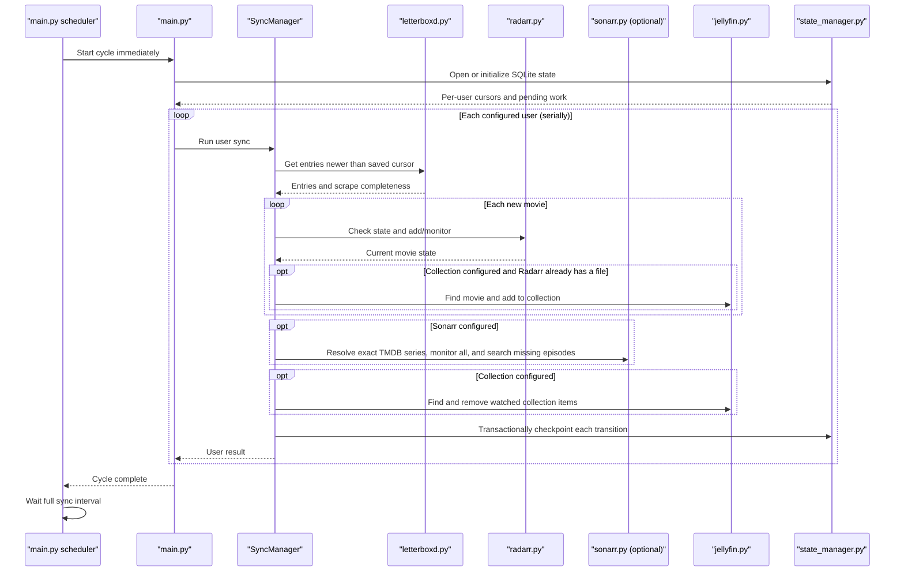

# Letterboxd-Jellyfin Integration

Sync Letterboxd watchlists with Radarr, optional Sonarr, and existing Jellyfin collections. Movies retain the Radarr/Jellyfin workflow, while series can be monitored and searched through Sonarr only.

## Table of contents

- [Features](#features)
- [How It Works](#how-it-works)
- [Prerequisites](#prerequisites)
- [Quick Start Guide](#quick-start-guide)
- [Configuration (`config.yaml`)](#configuration-configyaml)
- [Health and observability](#health-and-observability)
- [Troubleshooting](#troubleshooting)
- [Development](#development)
- [License](#license)

## Features

-   **Multi-User Support**: Syncs multiple Letterboxd users from one configuration file.
-   **Incremental Syncing**: After the first run, stops scraping when it reaches the newest movie saved by the previous run.
-   **Radarr Integration**: Adds missing movies with a configurable quality profile and root path and requests Radarr to monitor/search for them.
-   **Optional Sonarr Integration**: Adds series, monitors all seasons and newly added episodes, and immediately searches for missing episodes without adding series to Jellyfin.
-   **Jellyfin Collection Management**:
    -   Adds a newly discovered movie to an existing collection only when Radarr already reports a file during that same sync.
    -   Automatically removes movies from the collection after they have been watched by the user in Jellyfin.
-   **Optional Proxies**: Supports HTTP, HTTPS, SOCKS5, and SOCKS5H proxies, connectivity validation, and configurable direct-request fallback.
-   **Easy Deployment**: Includes a Dockerfile and production Compose configuration.
-   **Health and Observability**: Exposes structured JSON logs, health/readiness status, and Prometheus metrics.

## How It Works

The service runs one cycle immediately after startup. Each cycle performs the following work for every configured user:

1.  **Fetch New Items**: It classifies Letterboxd entries from their TMDB movie or TV links. When saved state exists, it stops at the previous Letterboxd entry. The first cycle after Sonarr is enabled performs one durable historical series-only pass without replaying historical movies; new users use one full mixed pass.
2.  **Process with Radarr**: The first dependent lookup in a cycle loads Radarr's installed-movie inventory once. Installed movies are resolved from that snapshot; each distinct TMDB ID missing from it uses at most one detail lookup during the cycle. The service still requests that each eligible user movie be added/monitored using the configured folder and quality profile. Failed Letterboxd detail and Radarr operations remain pending for a later cycle.
3.  **Update Jellyfin**:
    -   For each newly discovered movie that already has a Radarr file, it looks for the movie in Jellyfin and adds it to the configured collection. Failed Jellyfin operations remain pending without repeating a completed Radarr stage.
    -   It checks the collection for movies watched by the configured Jellyfin user and removes them.
4.  **Process with Sonarr**: When configured, the service resolves each series by exact TMDB identity, monitors all seasons and new items, and immediately requests a missing-episode search. Series never enter Jellyfin collection or watched-cleanup paths.
5.  **Checkpoint State**: It transactionally checkpoints the Letterboxd cursor, movie and series workflow records, and the one-time series-backfill marker in SQLite after discovery and every successful or retryable stage transition.

> **Current limitation:** After a successful Radarr queue attempt reports that a movie has no file, that movie is not revisited automatically when its download later completes. Jellyfin collection addition is attempted only when Radarr reports that it already has a file during the successful queue attempt. Add later downloads to Jellyfin manually if needed.

After a cycle finishes, the scheduler waits the full `system.sync_interval` before starting the next cycle. User processing is serial. One proxy manager and shared Radarr, optional Sonarr, and Jellyfin clients are used by all users in that cycle; provider inventory and lookup caches are discarded before the next cycle. Mutable per-user collection and watched-item responses are not cached.


```mermaid
sequenceDiagram
    participant Scheduler as "main.py scheduler"
    participant Main as "main.py"
    participant SyncManager as "SyncManager"
    participant Letterboxd as "letterboxd.py"
    participant Radarr as "radarr.py"
    participant Sonarr as "sonarr.py (optional)"
    participant Jellyfin as "jellyfin.py"
    participant State as "state_manager.py"

    Scheduler->>Main: Start cycle immediately
    Main->>State: Open or initialize SQLite state
    State-->>Main: Per-user cursors and pending work

    loop Each configured user (serially)
        Main->>SyncManager: Run user sync
        SyncManager->>Letterboxd: Get entries newer than saved cursor
        Letterboxd-->>SyncManager: Entries and scrape completeness

        loop Each new movie
            SyncManager->>Radarr: Check state and add/monitor
            Radarr-->>SyncManager: Current movie state
            opt Collection configured and Radarr already has a file
                SyncManager->>Jellyfin: Find movie and add to collection
            end
        end

        opt Sonarr configured
            SyncManager->>Sonarr: Resolve exact TMDB series, monitor all, and search missing episodes
        end

        opt Collection configured
            SyncManager->>Jellyfin: Find and remove watched collection items
        end
        SyncManager->>State: Transactionally checkpoint each transition
        SyncManager-->>Main: User result
    end

    Main-->>Scheduler: Cycle complete
    Scheduler->>Scheduler: Wait full sync interval
```


## Prerequisites

-   **Docker** and **Docker Compose** installed on your system.
-   A running **Jellyfin** instance.
-   At least one provider: a running **Radarr** instance, an operator-provided **Sonarr v3/v4** instance, or both. Sonarr is not included in either Compose stack.
-   The usernames of the Letterboxd accounts you wish to sync.
-   (Optional) A list of proxies if you plan to sync a large number of movies or run the script very frequently.

## Quick Start Guide

1.  **Clone the repository:**
    ```bash
    git clone https://github.com/MathisVerstrepen/letterboxd-jellyfin.git
    cd letterboxd-jellyfin
    ```

2.  **Create your configuration file:**
    Copy the example configuration file. `config.yaml` is ignored by Git and is not tracked by default, but it contains credentials: keep it secret and do not commit or share it.
    ```bash
    cp config.example.yaml config.yaml
    ```

3.  **Edit the configuration:**
    Open `config.yaml` and provide Jellyfin plus at least one of Radarr or Sonarr, along with each user mapping. Production Compose uses host networking, so every configured service URL must be reachable from the Docker host network namespace. Do not assume Docker service names such as `jellyfin`, `radarr`, or `sonarr` resolve in this production setup.

    Create or choose the Jellyfin collection first; the service does not create collections. Jellyfin remains required for every provider mode. Use root-folder and quality-profile values that exist in each configured Arr provider.

    If you use `letterboxd.proxy_file`, uncomment and adjust the optional `proxies.txt` bind mount in `docker-compose.yml` so the file exists at the configured path inside the application container.

4.  **Run the container:**
    Build and start the service in detached mode with Docker Compose.
    ```bash
    docker compose up -d --build
    ```

The first cycle starts immediately. If no persisted state exists, it processes each user's full Letterboxd watchlist; large watchlists may therefore take longer on the first run. Production Compose stores active state in `/app/data/sync_state.db`. On the first SQLite start only, an existing `/app/data/sync_state.json` in either the legacy flat format or version-2 format is imported before any external service client is initialized.

## Configuration (`config.yaml`)

Start with `config.example.yaml`. The following sample lists the current settings; replace placeholders with values for your deployment and keep credentials private.

```yaml
# General settings
system:
  sync_interval: 10       # How often to run the sync process, in minutes.
  log_level: INFO         # Log level: DEBUG, INFO, WARNING, ERROR

observability:
  host: "127.0.0.1"       # Host-local by default.
  port: 8000              # Embedded health and metrics listener.

# --- Service Connections ---
jellyfin:
  # Must be reachable from the host network namespace with production Compose.
  url: "http://127.0.0.1:8096"
  api_key: "YOUR_JELLYFIN_API_KEY"

# Optional movie provider; omit the entire section for Jellyfin + Sonarr-only mode.
radarr:
  # Must be reachable from the host network namespace with production Compose.
  url: "http://127.0.0.1:7878"
  api_key: "YOUR_RADARR_API_KEY"
  root_folder_path: "/movies"  # Path as Radarr sees it.
  quality_profile_id: 1         # ID of an existing Radarr quality profile.
  timeout: 60                   # Radarr request timeout in seconds.

    animated_movies:
    enabled: true             # Set to true to use a separate path for animations.
    root_folder_path: "/movies/Animated" # Path for animated movies.

# Optional series provider; omit the complete section for movie-only operation.
sonarr:
  url: "http://127.0.0.1:8989" # Operator-provided Sonarr v3/v4 API.
  api_key: "YOUR_SONARR_API_KEY"
  root_folder_path: "/series"   # Path as Sonarr sees it.
  quality_profile_id: 1          # ID of an existing Sonarr quality profile.
  timeout: 60
  animated_tv:
    enabled: true
    root_folder_path: "/series/Animated" # Alternative path as Sonarr sees it.

# --- Letterboxd & Proxies ---
letterboxd:
  max_concurrent_requests: 10  # Use a low value (for example, 2-4) without proxies.
  
  # Optional: Load proxies from a file (IP:PORT:USER:PASS format).
  proxy_file: "proxies.txt"
  proxy_type: "socks5h"       # 'http', 'https', 'socks5', or 'socks5h'.

  # Optional: Define proxies directly in this list. Ignored if proxy_file is set.
  proxies: []

  # Test configured proxies and remove unreachable entries once when a cycle starts.
  validate_proxies_on_startup: true
  # Retry directly if a request through a loaded proxy fails.
  allow_direct_fallback: true

# --- User Configuration ---
users:
  - letterboxd_username: "example"
    jellyfin_username: "example"
    # Find this in the URL of your Jellyfin collection: .../web/index.html#!/item?id=xxxxxxxx
    # Leave empty to continue Radarr processing but skip all Jellyfin collection work.
    jellyfin_collection_id: ""
```

`proxy_file` takes priority over `proxies`. If the configured file is missing or no usable proxies remain, the service logs the condition and uses direct requests. Proxy loading, validation, and rotation state are shared across all users in one cycle and rebuilt for the next cycle. `allow_direct_fallback` specifically controls whether a failed request through a loaded proxy is retried without one.

The `sonarr` section is absent-or-complete. When present, `url`, `api_key`, and `root_folder_path` must be non-empty strings, `quality_profile_id` must be a positive integer, and optional `timeout` must be a positive integer (default `60`). Optional global `animated_tv` requires a boolean `enabled`; when enabled, it also requires a non-empty alternative `root_folder_path`. Sonarr lookup resources are considered animated only when their `genres` value is a list containing the exact, case-sensitive element `Animation`. Animated routing changes only the root path: quality profile, monitor-all behavior, new-item monitoring, and immediate missing-episode search remain identical to standard series. Removing the Sonarr section pauses pending series work without deleting it; movies continue normally. Re-adding it resumes retries and does not repeat a completed historical backfill. A partial historical traversal leaves the durable backfill marker incomplete, so a later cycle retries the series-only pass while completed endpoint history prevents duplicate provider work.

Jellyfin is always required, and at least one of `radarr` or `sonarr` must be present. Radarr-only retains movie discovery and Jellyfin collection behavior; combined mode processes both media types. In Sonarr-only mode, Letterboxd movies are skipped while the shared cursor continues advancing, so those skipped movies are not backfilled if Radarr is configured later. Existing durable movie records are left unchanged until Radarr returns, while series processing and Jellyfin watched-item removal continue. A configured provider that is temporarily unavailable does not block the other provider; its failure is recorded safely and its pending work retries in a later cycle.

Configuration is loaded once at process startup. Restart the container after changing any setting:

```bash
docker compose restart letterboxd-sync
```

A restart triggers a cycle immediately. SQLite state is retained at `/app/data/sync_state.db` by production Compose, so normal restarts remain incremental and retry pending movie stages. `SYNC_STATE_DB_PATH` selects the authoritative SQLite database. `SYNC_STATE_PATH` selects only the legacy JSON import source. If `SYNC_STATE_DB_PATH` is unset, the database is derived beside the JSON source by replacing a final `.json` suffix with `.db`, or by appending `.db` otherwise.

When the database does not exist, a valid legacy flat or version-2 JSON source is imported once into a mode-`0600` schema-version-3 temporary database and atomically installed. The JSON file is not renamed, deleted, rewritten, or kept in sync afterward. Exact schema-version-1 and schema-version-2 SQLite databases are verified before a transactional upgrade to version 3; existing movie tables, rows, and indexes are retained, and separate series workflow and per-user backfill-marker tables are added. Completed movie and series endpoint history prevents rediscovery from repeating remote work. Once a database exists it always takes precedence: a corrupt, foreign, unsupported, or non-exact database stops the cycle rather than falling back to JSON.

Before the first schema-version-3 startup, stop the service and back up `sync_state.db` and any adjacent `sync_state.db-journal` file, plus the retained `sync_state.json`, using your normal filesystem backup process. A failed verified migration rolls back to the exact source version and stops before provider clients initialize. To restore state, stop the service and replace the database with a known-good application database. Do not delete an invalid database expecting automatic JSON recovery; retained JSON may be stale and reimporting it can repeat remote work.

Code that supports only schema version 2 cannot open a version-3 database. To roll back the application after a successful upgrade, stop the service and restore the complete pre-upgrade database backup; there is no supported in-place downgrade, and changing `PRAGMA user_version` or deleting series tables manually will fail exact validation. Removing the optional `sonarr` section safely pauses series processing without deleting state and is not a schema downgrade. SQLite checkpoints are transactional, but a remote add that succeeds immediately before a checkpoint failure remains at-least-once and can be retried.

## Health and observability

The service provides structured JSON logs plus `/health`, `/ready`, and `/metrics` endpoints on its embedded operational server. See [Health and observability](docs/health-and-observability.md) for listener security, endpoint semantics, Prometheus, metrics, and Grafana guidance.

## Troubleshooting

-   **How do I view the logs?**
    You can see the real-time output of the script with the following command:
    ```bash
    docker compose logs -f letterboxd-sync
    ```
    Each line is a structured JSON log object. For endpoint or metrics issues, follow the [observability troubleshooting guide](docs/health-and-observability.md#troubleshooting).

-   **Connection Refused Errors:**
    Production Compose uses host networking. Confirm every configured Jellyfin, Radarr, and Sonarr URL is reachable from the Docker host itself and that each service listens on the specified address and port. Docker service names from another Compose network are not generic production hostnames.

-   **403 Forbidden Errors from Letterboxd:**
    This means Letterboxd is blocking your requests, likely due to a high volume.
    -   Lower the `max_concurrent_requests` value.
    -   Increase the `sync_interval`.
    -   Configure and use proxies.

-   **Movies are queued but do not appear in the Jellyfin collection:**
    Collection addition is attempted only for newly discovered entries that already have a Radarr file. A download that completes later is not revisited automatically. Also confirm the movie is visible in Jellyfin and `jellyfin_collection_id` is not empty.

-   **Collection lookup errors:**
    Confirm that `jellyfin_collection_id` identifies an existing collection. Leaving it empty intentionally disables both collection additions and watched-item removal while Radarr processing continues.

## Development

A Python 3.11 development environment can install the application and test dependencies and run the complete test suite without starting Docker or contacting configured services:

```bash
python -m pip install -r requirements-dev.txt
python -m ruff check .
python -m pytest
```

A `docker-compose.dev.yml` file is included to start separate Radarr and Jellyfin instances for development. It does not start Sonarr or the Letterboxd-Jellyfin sync service; use an operator-provided Sonarr instance when testing that optional integration. The development services use `latest` images, store data under `dev-environment/`, and publish Radarr on port `7879` and Jellyfin on ports `8097`/`8921`.

To use it, run:
```bash
docker compose -f docker-compose.dev.yml up -d
```

## License

This project is licensed under the MIT License.
