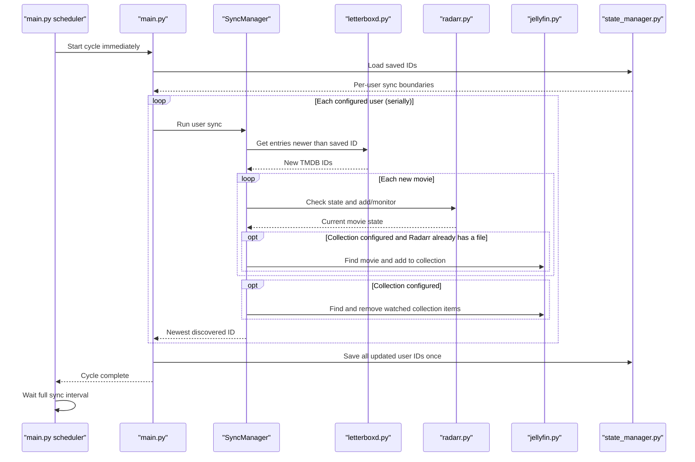

# Letterboxd-Jellyfin Integration

Sync Letterboxd watchlists with Radarr and existing Jellyfin collections. The service discovers newly added watchlist movies, adds or monitors them in Radarr, adds movies that are already available to the configured Jellyfin collection, and removes watched collection items on a schedule.


## Features

-   **Multi-User Support**: Syncs multiple Letterboxd users from one configuration file.
-   **Incremental Syncing**: After the first run, stops scraping when it reaches the newest movie saved by the previous run.
-   **Radarr Integration**: Adds missing movies with a configurable quality profile and root path and requests Radarr to monitor/search for them.
-   **Jellyfin Collection Management**:
    -   Adds a newly discovered movie to an existing collection only when Radarr already reports a file during that same sync.
    -   Automatically removes movies from the collection after they have been watched by the user in Jellyfin.
-   **Optional Proxies**: Supports HTTP, HTTPS, SOCKS5, and SOCKS5H proxies, connectivity validation, and configurable direct-request fallback.
-   **Easy Deployment**: Includes a Dockerfile and production Compose configuration.
-   **Health and Observability**: Exposes structured JSON logs, health/readiness status, and Prometheus metrics.


## How It Works

The service runs one cycle immediately after startup. Each cycle performs the following work for every configured user:

1.  **Fetch New Movies**: It scrapes the user's Letterboxd watchlist. When saved state exists, it stops at the previously saved movie and processes only newer entries. With no saved state, the first run processes the full watchlist.
2.  **Process with Radarr**: For each newly discovered movie, it checks Radarr and requests that the movie be added/monitored using the configured folder and quality profile.
3.  **Update Jellyfin**:
    -   For each newly discovered movie that already has a Radarr file, it looks for the movie in Jellyfin and adds it to the configured collection.
    -   It checks the collection for movies watched by the configured Jellyfin user and removes them.
4.  **Save State**: After all users have been processed, it saves each user's newest discovered TMDB ID once for the cycle.

> **Current limitation:** A movie newly queued in Radarr is not revisited automatically after its download completes. Jellyfin collection addition is attempted only while that movie is first processed as a new Letterboxd entry, and only if Radarr reports that it already has a file at that time. Add later downloads to Jellyfin manually if needed.

After a cycle finishes, the scheduler waits the full `system.sync_interval` before starting the next cycle. User processing is serial.


```mermaid
sequenceDiagram
    participant Scheduler as "main.py scheduler"
    participant Main as "main.py"
    participant SyncManager as "SyncManager"
    participant Letterboxd as "letterboxd.py"
    participant Radarr as "radarr.py"
    participant Jellyfin as "jellyfin.py"
    participant State as "state_manager.py"

    Scheduler->>Main: Start cycle immediately
    Main->>State: Load saved IDs
    State-->>Main: Per-user sync boundaries

    loop Each configured user (serially)
        Main->>SyncManager: Run user sync
        SyncManager->>Letterboxd: Get entries newer than saved ID
        Letterboxd-->>SyncManager: New TMDB IDs

        loop Each new movie
            SyncManager->>Radarr: Check state and add/monitor
            Radarr-->>SyncManager: Current movie state
            opt Collection configured and Radarr already has a file
                SyncManager->>Jellyfin: Find movie and add to collection
            end
        end

        opt Collection configured
            SyncManager->>Jellyfin: Find and remove watched collection items
        end
        SyncManager-->>Main: Newest discovered ID
    end

    Main->>State: Save all updated user IDs once
    Main-->>Scheduler: Cycle complete
    Scheduler->>Scheduler: Wait full sync interval
```


## Prerequisites

-   **Docker** and **Docker Compose** installed on your system.
-   A running **Jellyfin** instance.
-   A running **Radarr** instance.
-   The usernames of the Letterboxd accounts you wish to sync.
-   (Optional) A list of proxies if you plan to sync a large number of movies or run the script very frequently.

## Quick Start Guide

1.  **Clone the repository:**
    ```bash
    git clone https://github.com/MathisVerstrepen/letterboxd-jellyfin.git
    cd letterboxd-jellyfin
    ```

2.  **Create your configuration file:**
    Copy the example configuration file. `config.yaml` is ignored by Git and is not tracked by default, but it contains credentials: keep it secret and do not commit or share it.
    ```bash
    cp config.example.yaml config.yaml
    ```

3.  **Edit the configuration:**
    Open `config.yaml` and provide your Jellyfin and Radarr URLs/API keys plus each user mapping. Production Compose uses host networking, so both service URLs must be reachable from the Docker host network namespace. For services published on the same host, values such as `http://127.0.0.1:8096` and `http://127.0.0.1:7878` may be appropriate. Do not assume Docker service names such as `jellyfin` or `radarr` resolve in this production setup.

    Create or choose the Jellyfin collection first; the service does not create collections. Jellyfin API keys are managed in the Jellyfin dashboard, and the collection ID appears in the collection page URL. Radarr's API key is available under **Settings > General**; use root-folder and quality-profile values that exist in your Radarr instance.

    If you use `letterboxd.proxy_file`, uncomment and adjust the optional `proxies.txt` bind mount in `docker-compose.yml` so the file exists at the configured path inside the application container.

4.  **Run the container:**
    Build and start the service in detached mode with Docker Compose.
    ```bash
    docker compose up -d --build
    ```

The first cycle starts immediately. If no persisted state exists, it processes each user's full Letterboxd watchlist; large watchlists may therefore take longer on the first run.

## Configuration (`config.yaml`)

Start with `config.example.yaml`. The following sample lists the current settings; replace placeholders with values for your deployment and keep credentials private.

```yaml
# General settings
system:
  sync_interval: 10       # How often to run the sync process, in minutes.
  log_level: INFO         # Log level: DEBUG, INFO, WARNING, ERROR

observability:
  host: "127.0.0.1"       # Host-local by default.
  port: 8000              # Embedded health and metrics listener.

# --- Service Connections ---
jellyfin:
  # Must be reachable from the host network namespace with production Compose.
  url: "http://127.0.0.1:8096"
  api_key: "YOUR_JELLYFIN_API_KEY"

radarr:
  # Must be reachable from the host network namespace with production Compose.
  url: "http://127.0.0.1:7878"
  api_key: "YOUR_RADARR_API_KEY"
  root_folder_path: "/movies"  # Path as Radarr sees it.
  quality_profile_id: 1         # ID of an existing Radarr quality profile.
  timeout: 60                   # Radarr request timeout in seconds.

  animated_movies:
    enabled: true             # Set to true to use a separate path for animations.
    root_folder_path: "/movies/Animated" # Path for animated movies.

# --- Letterboxd & Proxies ---
letterboxd:
  max_concurrent_requests: 10  # Use a low value (for example, 2-4) without proxies.
  
  # Optional: Load proxies from a file (IP:PORT:USER:PASS format).
  proxy_file: "proxies.txt"
  proxy_type: "socks5h"       # 'http', 'https', 'socks5', or 'socks5h'.

  # Optional: Define proxies directly in this list. Ignored if proxy_file is set.
  proxies: []

  # Test configured proxies and remove unreachable entries when a user sync starts.
  validate_proxies_on_startup: true
  # Retry directly if a request through a loaded proxy fails.
  allow_direct_fallback: true

# --- User Configuration ---
users:
  - letterboxd_username: "example"
    jellyfin_username: "example"
    # Find this in the URL of your Jellyfin collection: .../web/index.html#!/item?id=xxxxxxxx
    # Leave empty to continue Radarr processing but skip all Jellyfin collection work.
    jellyfin_collection_id: ""
```

`proxy_file` takes priority over `proxies`. If the configured file is missing or no usable proxies remain, the service logs the condition and uses direct requests. `allow_direct_fallback` specifically controls whether a failed request through a loaded proxy is retried without one.

Configuration is loaded once at process startup. Restart the container after changing any setting:

```bash
docker compose restart letterboxd-sync
```

A restart triggers a cycle immediately. Persisted state is retained at `/app/data/sync_state.json` by production Compose, so normal restarts remain incremental. Removing or losing that state causes the next run to process the full watchlist again. State updates are written once after all configured users finish each cycle.

## Health and observability

The service provides structured JSON logs plus `/health`, `/ready`, and `/metrics` endpoints on its embedded operational server. See [Health and observability](docs/health-and-observability.md) for listener security, endpoint semantics, Prometheus, metrics, and Grafana guidance.

## Troubleshooting

-   **How do I view the logs?**
    You can see the real-time output of the script with the following command:
    ```bash
    docker compose logs -f letterboxd-sync
    ```
    Each line is a structured JSON log object. For endpoint or metrics issues, follow the [observability troubleshooting guide](docs/health-and-observability.md#troubleshooting).

-   **Connection Refused Errors:**
    Production Compose uses host networking. Confirm the configured Radarr and Jellyfin URLs are reachable from the Docker host itself and that the services listen on the specified addresses and ports. Docker service names from another Compose network are not generic production hostnames.

-   **403 Forbidden Errors from Letterboxd:**
    This means Letterboxd is blocking your requests, likely due to a high volume.
    -   Lower the `max_concurrent_requests` value.
    -   Increase the `sync_interval`.
    -   Configure and use proxies.

-   **Movies are queued but do not appear in the Jellyfin collection:**
    Collection addition is attempted only for newly discovered entries that already have a Radarr file. A download that completes later is not revisited automatically. Also confirm the movie is visible in Jellyfin and `jellyfin_collection_id` is not empty.

-   **Collection lookup errors:**
    Confirm that `jellyfin_collection_id` identifies an existing collection. Leaving it empty intentionally disables both collection additions and watched-item removal while Radarr processing continues.

## Development

A `docker-compose.dev.yml` file is included to start separate Radarr and Jellyfin instances for development. It does not start the Letterboxd-Jellyfin sync service. The development services use `latest` images, store data under `dev-environment/`, and publish Radarr on port `7879` and Jellyfin on ports `8097`/`8921`.

To use it, run:
```bash
docker compose -f docker-compose.dev.yml up -d
```

## License

This project is licensed under the MIT License.
